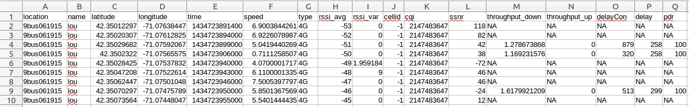
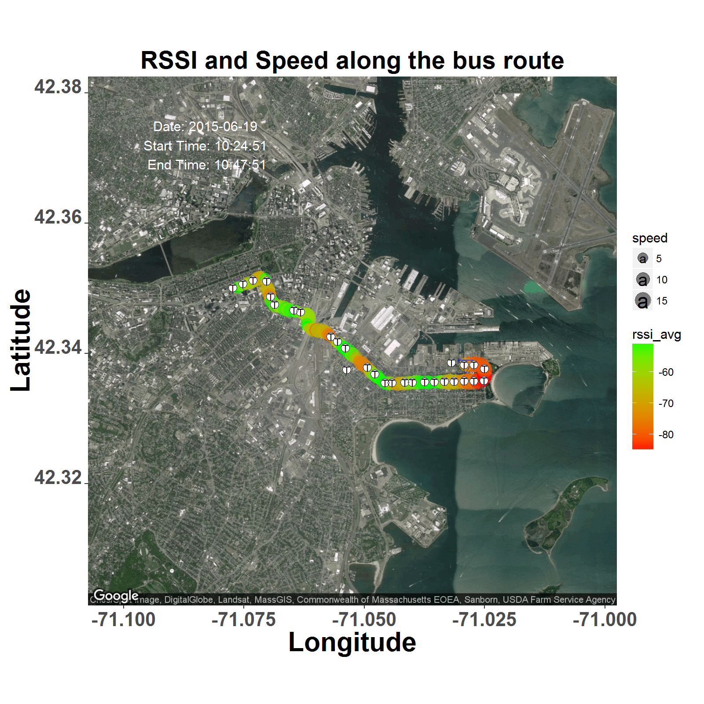
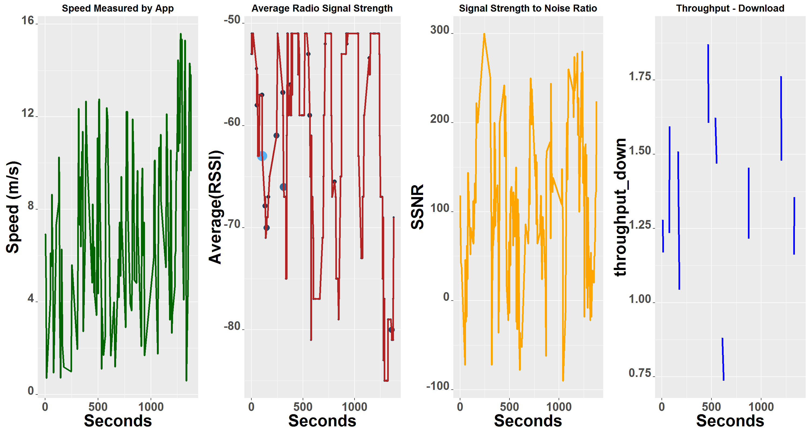
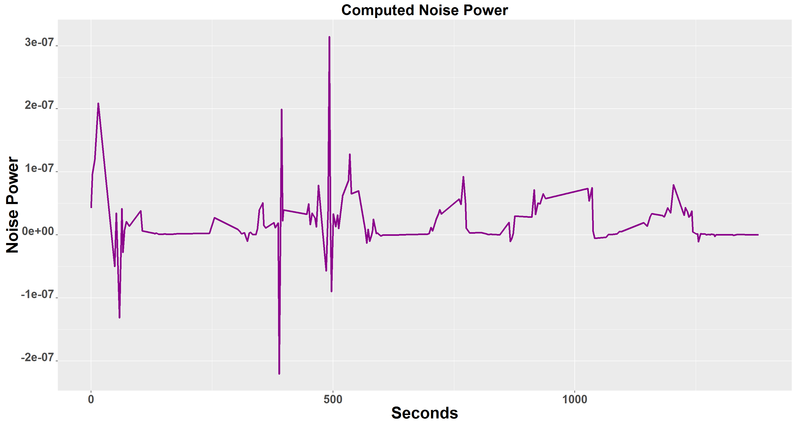
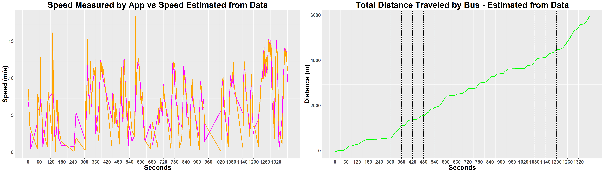

Visualizing Smart Phone Data from Wireless Network Monitoring App
=================================================================

Please feel free to use the code in your research and development works. We would appreciate a citation to our work when this code is helpful in obtaining results in your future publications.

This work was carried out by **Ram Subramanian** at GENESYS Lab, ECE Dept., NEU. *Wireless Network Monitoring App* was shared with us by Prof. Marco Di Felice, University of Bologna. Refer to **Wireless_Network_Monitor_App.pdf** for details on the features in the data recorded by the App. Thanks to **James Delosh** and **Timothy Rupprecht** for their support in carrying out the experiments and data collection. 

### Initialize Workspace and Libraries

Clear workspace & console. This is necessary to clear the console of print as well as clear the memory of all other variables before publishing this script.

```{r, eval = FALSE}
rm(list = ls(all.names = TRUE))
cat("\014")
```

Next step is to load all necessary Libraries.

```{r, eval = FALSE}
library(dplyr)
library(ggmap)
library(R.devices)
library(data.table)
library(geosphere)
library(rmarkdown)
```

Subsampling is useful in dealing with over-sampling of input. This parameter is hard coded at the beginning of the script.

```{r, eval = FALSE}
decimation_factor=1;
```

Setup the working directory.

```{r, eval = FALSE}
(WD <- getwd())
if (!is.null(WD)) setwd(WD)
```
Source accompanying functions. Load the multiplot() function.
```{r, eval = FALSE}
source("multiplot.R")
```

### Load Bus Route 9
We now load bus route information into the script. To eliminate ambiguity when referencing locations the pharse "Boston, MA." is suffixed prioir to translating its geo-location.
```{r, eval = FALSE}
#Load Bus Route
BusRouteStops <- scan("../DATA/Bus_Routes/busRoute_9",what="character",sep="\n")
paste_MA <- function(x){paste(x,"Boston, MA")}
BusRouteStops <- lapply(BusRouteStops,paste_MA)
##Geo-code bus stop locations along a bus route
Geocode_BusStops <- function(x){geocode(x)}
BusStopsCoordinatesMA <- lapply(BusRouteStops,Geocode_BusStops)
BusStopsCoordinatesMA <- rbindlist(BusStopsCoordinatesMA)
```

The script goes on to load all the necessary data that's gathered beforehand. 

A snap-shot of the RF data in .csv format recorded by the App.


We then retrieve the RF data from the .csv file.
```{r, eval = FALSE}
#Retrieve RF data from CSV file
#The .csv file is read and a data frame 'radio_data' is returned
radio_data <- read.csv("../DATA/RecordedOnBus/Bus_9.csv", header=TRUE, sep=" ", row.names=NULL)
if(any(names(radio_data)=="row.names")){radio_data<-select(radio_data,-row.names,-name,-location)} else {{radio_data<-select(radio_data,-name,-location)}}
if(!any(names(radio_data)=="type") && ncol(radio_data)>11) {cnames <- c("latitude", "longitude", "time", "speed", "type", "rssi_avg", "rssi_var", "cellid", "cqi", "ssnr", "throughput_down", "throughput_up", "delayCon", "delay", "pdr") 
                                                  colnames(radio_data) <- cnames} else if(!any(names(radio_data)=="type") && ncol(radio_data)==21) {cnames <- c("latitude", "longitude", "time", "speed", "type", "rssi_avg", "rssi_var", "cellid", "cqi", "ssnr", "throughput_down", "throughput_up", "delayCon", "delay", "pdr", "X", "X.1", "numWiFiOpen", "X.2", "numWiFiFreeChannels", "X.3")
                                                                                        colnames(radio_data) <- cnames} else if(!any(names(radio_data)=="type") && ncol(radio_data)==10) {cnames <- c("latitude", "longitude", "time", "speed", "type", "rssi_avg", "rssi_var", "cellid", "cqi", "ssnr")
                                                                                                                                                       colnames(radio_data) <- cnames}
```
Now, it's time to tidy up our data. The script proceeds to work with only those rows that don't have unrealistic entries, uninformative columns.

```{r, eval = FALSE}
# Retain only columns of interest
radio_data<-select(radio_data,1:11)

# Remove rows which have rssi_avg == 0
c <- radio_data['rssi_avg']!= 0.00000
radio_data <- radio_data[c,]

# Subsample Data
b<-seq(1,nrow(radio_data),decimation_factor)
radio_data<-radio_data[b,]
```

## Analysis of Smartphone RF Data

Now in order to closely analyze the data we make exploratory plots.

It would be very useful to estimate the elapsed time in seconds.
```{r, eval = FALSE}
radio_data[,'time_elapsed_sec'] <- (radio_data['time']-radio_data['time'][1,1])/1000
```
Determine time and date specific to EST from an unreadable mobile OS specific format.
```{r, eval = FALSE}
real_time <- function(x){as.POSIXct(x, origin="1970-01-01", tz="EST")}
radio_data['time']<-lapply(3600+radio_data['time']/1000,real_time)
date <- strsplit(as.character(radio_data['time'][1,])," ")[[1]][1]
```

Determine start and end times of data collection.
```{r, eval = FALSE}
#Start Time
start_time <- strsplit(as.character(radio_data['time'][1,])," ")[[1]][2]

#End Time
end_time <- strsplit(as.character(radio_data['time'][nrow(radio_data),])," ")[[1]][2]

d<-(1:nrow(radio_data))
k<-d[c][b]
```

## Visualizing the RF data across Space and Time

We display our data over a satalite image in the form of a circle filled with a color. Data points consisting of speed and rssi averages are represented on the map by the size of the circle and color of the circle respectively. We mark on the map the locations of bus stops.

```{r, eval = FALSE}
map<-get_map(location = c(longitude = colMeans(radio_data['longitude']), latitude = colMeans(radio_data['latitude'])), maptype = "satellite", zoom = 13 , scale = "auto")
```

Draw the bird eye's map centered on the mobile user's commute route with the appropriate zoom.
```{r, eval = FALSE}
mapRadioPlots <- ggmap(map) + geom_point(aes(x = longitude, y = latitude, color=rssi_avg, size=speed), data = radio_data, alpha = .5) + 
  scale_color_gradient(low="red", high="green") + 
  geom_point(aes(x = longitude, y = latitude), data = radio_data[1,], size=4, color="purple", shape=24, alpha = 1) + 
  geom_point(aes(x = longitude, y = latitude), data = radio_data[nrow(radio_data),], size=4, color="blue", shape=25, alpha = 1) +
  labs(title ="RSSI and Speed along the bus route", x = "Longitude", y = "Latitude")  + theme(plot.title = element_text(face="bold", size=20)) + 
    theme(axis.title.x = element_text(face="bold", size=22), axis.text.x  = element_text(face="bold", angle=0, vjust=0.0, size=16)) + theme(axis.title.y = element_text(face="bold", size=22), axis.text.y  = element_text(face="bold", angle=0, vjust=0.0, size=16)) + 
  annotate("text", x=colMeans(radio_data['longitude'])-0.030, y=colMeans(radio_data['latitude'])+0.030, label = paste("Date:", date, "\nStart Time:", start_time,"\nEnd Time:", end_time), colour = "white")
```

Plot the geo-referenced points on the route from the formatted .csv file. Add bus stops to map and output the map.
```{r, eval = FALSE}
mapRadioPlots <- mapRadioPlots + geom_point(aes(x = lon, y = lat), data = BusStopsCoordinatesMA, color="White", size=3, shape=16, alpha = 1) + 
  geom_text(data=BusStopsCoordinatesMA, mapping=aes(x=lon, y=lat, label="T", size=3)) + 
  geom_point(aes(x = lon, y = lat), data = BusStopsCoordinatesMA, size=3, shape=1, alpha = 1)
```

Save the output plot as a .png file.
```{r, eval = FALSE}
png("RFDataAlongBusRoute.png",width=8,height=8,units="in",res=200)
multiplot(mapRadioPlots, cols = 1)
dev.off()
```
dev.off() is mandatory for saving the output. It flushes the I/O buffer.



## Visualizing key features in the RF data

```{r, eval = FALSE}
p1 <- ggplot(radio_data, aes(x = time_elapsed_sec, y = speed))+geom_line(size=1.05, color="darkgreen")+ggtitle('Speed Measured by App')+labs(x="Seconds", y="Speed (m/s)") + theme(plot.title = element_text(face="bold", size=13)) + 
  theme(axis.title.x = element_text(face="bold", size=22), axis.text.x  = element_text(face="bold", angle=0, vjust=0.0, size=16)) + theme(axis.title.y = element_text(face="bold", size=22), axis.text.y  = element_text(face="bold", angle=0, vjust=0.0, size=16))
p2 <- ggplot(radio_data, aes(x = time_elapsed_sec, y = rssi_avg))+geom_point(aes(size= rssi_var, color=rssi_var))+geom_line(size=1.05, color="firebrick")+theme(legend.position="none")+ggtitle('Average Radio Signal Strength')+labs(x="Seconds", y="Average(RSSI)") + theme(plot.title = element_text(face="bold", size=13)) + 
  theme(axis.title.x = element_text(face="bold", size=22), axis.text.x  = element_text(face="bold", angle=0, vjust=0.0, size=16)) + theme(axis.title.y = element_text(face="bold", size=22), axis.text.y  = element_text(face="bold", angle=0, vjust=0.0, size=16))
p3 <- ggplot(radio_data, aes(x = time_elapsed_sec, y = ssnr))+geom_line(size=1.05, color="orange")+ggtitle('Signal Strength to Noise Ratio')+labs(x="Seconds", y="SSNR") + theme(plot.title = element_text(face="bold", size=13)) + 
  theme(axis.title.x = element_text(face="bold", size=22), axis.text.x  = element_text(face="bold", angle=0, vjust=0.0, size=16)) + theme(axis.title.y = element_text(face="bold", size=22), axis.text.y  = element_text(face="bold", angle=0, vjust=0.0, size=16))
p4 <- ggplot(radio_data, aes(x = time_elapsed_sec, y = throughput_down))+geom_line(size=1.05, color="blue")+ggtitle('Throughput - Download')+labs(x="Seconds", y="throughput_down") + theme(plot.title = element_text(face="bold", size=13)) + 
  theme(axis.title.x = element_text(face="bold", size=22), axis.text.x  = element_text(face="bold", angle=0, vjust=0.0, size=16)) + theme(axis.title.y = element_text(face="bold", size=22), axis.text.y  = element_text(face="bold", angle=0, vjust=0.0, size=16))
```

Save the output plot as a .png file.
```{r, eval = FALSE}
png("KeyFeaturesInRFdata.png",width=15,height=8,units="in",res=200)
multiplot(p1, p2, p3, p4, cols = 4)
dev.off()
```



Let's now compute from the noise power in the signal.
```{r, eval = FALSE}
p5 <- ggplot(radio_data, aes(x = time_elapsed_sec, y = 10^(0.1*rssi_avg)/ssnr))+geom_line(size=1.05, color="darkmagenta")+ggtitle('Computed Noise Power')+labs(x="Seconds", y="Noise Power") + theme(plot.title = element_text(face="bold", size=20)) + 
    theme(axis.title.x = element_text(face="bold", size=22), axis.text.x  = element_text(face="bold", angle=0, vjust=0.0, size=16)) + theme(axis.title.y = element_text(face="bold", size=22), axis.text.y  = element_text(face="bold", angle=0, vjust=0.0, size=16))
```

Save the output plot as a .png file.
```{r, eval = FALSE}
png("NoisePower.png",width=15,height=8,units="in",res=200)
multiplot(p5, cols = 1)
dev.off()
```



We compare the speed measured by the App using the Smartphone's accelerometer with the speed estimated from the data.

```{r, eval = FALSE}
SpatialPoints <-  radio_data[,c('longitude','latitude')]
SpatialPointsShiftBy1 <-  SpatialPoints[-1,]
#Great-circle-distance using WGS84 ellipsoid
DistanceMoved <- distVincentyEllipsoid(SpatialPointsShiftBy1, SpatialPoints, a=6378137, b=6356752.3142, f=1/298.257223563)
DistanceMoved <- DistanceMoved[-length(DistanceMoved)]
SamplingEpoch <- diff(radio_data[,'time_elapsed_sec'])
radio_data[,'speed_estimated'] <- append(NA,DistanceMoved/SamplingEpoch)
radio_data[,'total_distance'] <- append(NA,cumsum(DistanceMoved))
p6 <- ggplot(radio_data, aes(time_elapsed_sec)) + geom_line(aes(y=speed), size=1.05, colour="magenta") + geom_line(aes(y=speed_estimated), size=1.05, colour="orange") +
  scale_x_continuous(breaks=seq(0,tail(radio_data[,'time_elapsed_sec'],1),by=60))+ggtitle('Speed Measured by App vs Speed Estimated from Data')+labs(x="Seconds", y="Speed (m/s)") + theme(plot.title = element_text(face="bold", size=28)) + 
  theme(axis.title.x = element_text(face="bold", size=22), axis.text.x  = element_text(face="bold", angle=0, vjust=0.0, size=16)) + theme(axis.title.y = element_text(face="bold", size=22), axis.text.y  = element_text(face="bold", angle=0, vjust=0.0, size=16))
p7 <- ggplot(radio_data, aes(time_elapsed_sec)) + geom_line(aes(y=total_distance), size=1.05, colour="green") + geom_vline(xintercept = c(60,120,360,420,480,660,720,840,960,1080,1140,1200), linetype = "longdash") + geom_vline(xintercept = c(180,300,540,660), colour="red", linetype = "longdash") + scale_x_continuous(breaks=seq(0,tail(radio_data[,'time_elapsed_sec'],1),by=60))+ggtitle('Total Distance Traveled by Bus - Estimated from Data')+labs(x="Seconds", y="Distance (m)") + theme(plot.title = element_text(face="bold", size=28)) + 
  theme(axis.title.x = element_text(face="bold", size=22), axis.text.x  = element_text(face="bold", angle=0, vjust=0.0, size=16)) + theme(axis.title.y = element_text(face="bold", size=22), axis.text.y  = element_text(face="bold", angle=0, vjust=0.0, size=16))
```

Save the output plot as a .png file.
```{r, eval = FALSE}
png("SpeedDistanceEstimate.png",width=28,height=8,units="in",res=200)
multiplot(p6, p7, cols = 2)
dev.off()
```



### References

- [ggmap package](https://cran.r-project.org/web/packages/ggmap/index.html)
- [R Markdown Tutorial](http://rmarkdown.rstudio.com/)
- [MBTA Bus Route 9 Info](http://www.mbtainfo.com/9?t=popular)
